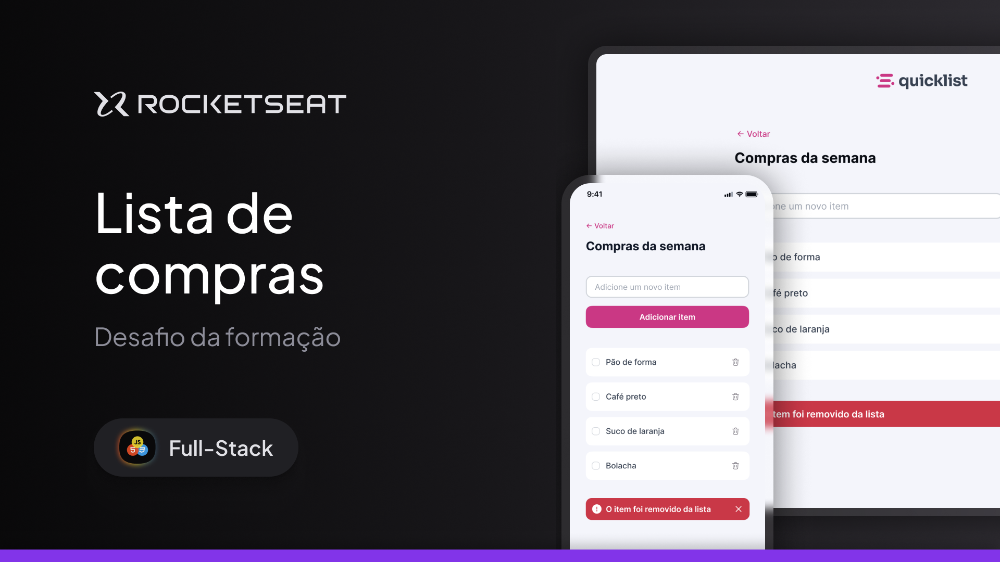

# 🛒 Lista de Compras

Uma aplicação web simples e responsiva para gerenciar uma lista de compras de forma prática e intuitiva.

---

## ✨ Funcionalidades

- ✅ Adiciona novos itens com validação (somente letras)
- 🗑️ Remove itens individualmente ao clicar na lixeira
- ☑️ Marca itens como concluídos (com checkbox personalizado)
- 🖌️ Interface visual com estilo moderno
- 📱 Totalmente responsivo (funciona em mobile e desktop)

---

## 🛠 Tecnologias utilizadas

- **HTML5**
- **CSS3** (com uso de variáveis, flex, media queries)
- **JavaScript puro (Vanilla JS)**

---

## 🚀 Acessar o projeto

Você pode rodar localmente ou visualizar online:

🔗 [Ver no GitHub Pages](https://seu-usuario.github.io/seu-repositorio/)

> Substitua o link acima pelo real após o deploy.

---

## 📸 Preview

---

## 🤝 Contribuição

Sinta-se à vontade para abrir issues ou enviar pull requests.  
Toda contribuição é bem-vinda! 💜

---

## 📄 Licença

Este projeto está licenciado sob a **MIT License**.  
Veja o arquivo [LICENSE](LICENSE) para mais detalhes.
